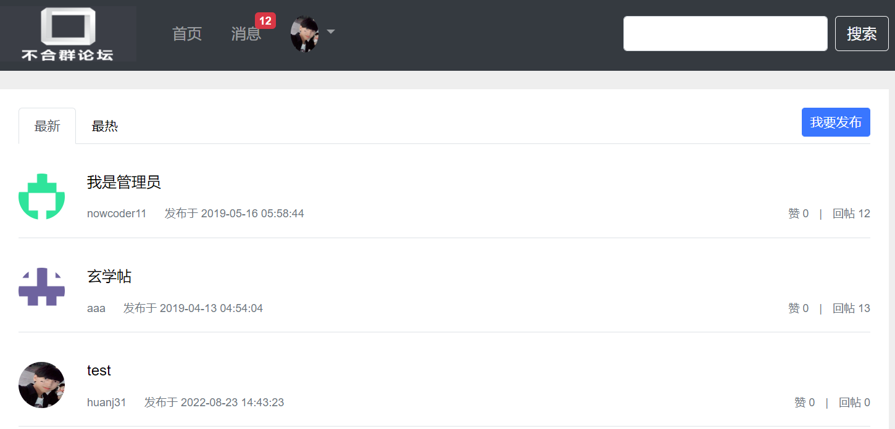

# Unsocial Forum
## Description
The project is a web application of an online forum. The users can communicate with each other through sending and commenting posts. They are also able to send private messages to each other.  
## Technology used
* Used *SpringBoot* as the fundamental framework to manage other technologies
* Utilized *Mybatis-Plus* to perform basic CRUD operations and more complex queries on *MYSQL* database
* Enhanced query efficiency through *Redis* cache
* Developed system notification setting through *Kafka*
* Implemented a *Trie* to prevent users from sending sensitive words
* Unified log records through *Spring AOP*

## Demo
